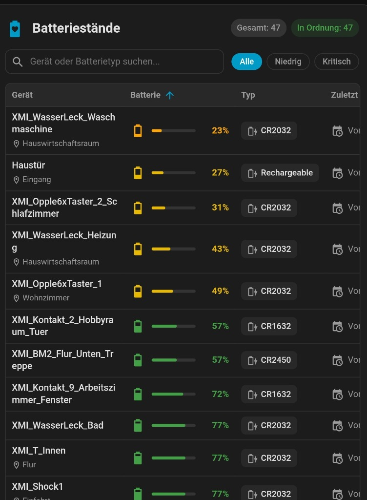

# 🔋 Battery Notes Card

[](https://github.com/hacs/default)
[](https://github.com/vitals5/battery-notes-card/releases)
[](LICENSE)

A modern, responsive, and highly customizable **Home Assistant Dashboard Card** (Lovelace) designed as the dedicated companion for the popular [Battery Notes](https://github.com/andrew-codechimp/HA-Battery-Notes) integration by Andrew CodeChimp.

The card automatically aggregates and displays all devices tracked by Battery Notes in a clean, interactive tabular overview—including battery level (percentage & color-coded progress bar), battery type and quantity (e.g. `CR2032`, `2x AAA`), last replaced date, notes, and a **direct action button to record battery replacements**.

<p align="center">
  
</p>

---

## ✨ Features

- 🔍 **Automatic Discovery**: Automatically detects and aggregates all devices managed by Battery Notes without requiring manual entity configuration.
- 📊 **Tabular Overview**: Displays device name, battery level (percentage & colored bar), battery type/quantity, last replaced date, status badge, and custom notes.
- 🔄 **Direct Battery Replacement**: One-click action button calls the `battery_notes.set_battery_replaced` service with visual success feedback and confirmation dialog.
- 🔎 **Live Search & Quick Filters**: Search in real-time by device name or battery type (e.g. type `"CR2032"` to see all devices using that battery) or switch between *All*, *Low (< 20%)*, and *Critical (< 10%)* filters.
- ↕️ **Sortable Columns**: Click table column headers to sort ascending or descending by battery level, name, type, last replaced date, or status.
- 🎨 **Visual UI Editor**: Fully customizable through the Home Assistant dashboard UI editor—no YAML required.
- 📱 **Responsive Container Queries**: Seamlessly adapts layout, padding, and font sizes to mobile devices, narrow dashboard columns, and sidebars.
- 🌐 **Multi-language**: Built-in localization (English and German) automatically selected based on your Home Assistant user language.

---

## 📦 Installation via HACS (Recommended)

### Option 1: Direct link (My Home Assistant)

Click the badge below to open the repository directly in HACS on your Home Assistant instance:

[](https://my.home-assistant.io/redirect/hacs_repository/?owner=vitals5&repository=battery-notes-card&category=plugin)

### Option 2: Add Custom Repository manually in HACS

1. Open **HACS** in your Home Assistant instance.
2. Click the three-dots menu (**⋮**) in the top right corner and select **Custom repositories**.
3. Enter the repository URL:
   ```text
   https://github.com/vitals5/battery-notes-card
   ```
4. Select **Dashboard** (or *Plugin*) as the category.
5. Click **Add**.
6. Search for **Battery Notes Card** in HACS, click on it, and select **Download**.
7. Refresh your browser (or press `Ctrl + F5`) when prompted.

---

## 🛠️ Manual Installation

1. Download the `battery-notes-card.js` file from the [Releases](https://github.com/vitals5/battery-notes-card/releases) page or the `dist/` directory.
2. Copy the file to your Home Assistant configuration directory under `config/www/battery-notes-card.js`.
3. In Home Assistant, navigate to **Settings** ➔ **Dashboards** ➔ **Resources** (three-dots menu in the top right) and add a new resource:
   - **URL:** `/local/battery-notes-card.js?v=1.0.6`
   - **Resource Type:** `JavaScript Module`
4. Refresh your dashboard.

---

## 🚀 Usage

### Via Visual Editor
1. In your dashboard, click **Edit Dashboard** ➔ **Add Card**.
2. Search for **Battery Notes Card**.
3. Customize title, visible columns, default sorting, and filters using the intuitive visual editor.

### Via YAML

#### 1. Default Configuration (Automatic device discovery)
```yaml
type: custom:battery-notes-card
title: Battery Levels
```

#### 2. Low Battery Alert Card (Only show devices needing replacement)
```yaml
type: custom:battery-notes-card
title: Battery Replacement Needed
filter_low_only: true
show_filters: false
columns:
  name: true
  battery: true
  type: true
  last_replaced: true
  actions: true
```

#### 3. Compact View (Ideal for sidebars and small screens)
```yaml
type: custom:battery-notes-card
title: Batteries
compact: true
show_summary: false
show_search: false
sort_by: battery
sort_direction: asc
columns:
  name: true
  battery: true
  type: true
  last_replaced: false
  actions: true
```

#### 4. Full Configuration Example
```yaml
type: custom:battery-notes-card
title: All Batteries & Notes
icon: mdi:battery-heart-variant
show_header: true
show_summary: true
show_search: true
show_filters: true
compact: false
confirm_replace: true
sort_by: battery
sort_direction: asc
filter_threshold: 20
hide_unavailable: false
max_rows: 25
exclude_entities:
  - sensor.test_sensor_battery_type
columns:
  name: true
  battery: true
  type: true
  last_replaced: true
  status: true
  note: true
  actions: true
```

---

## ⚙️ Configuration Reference

| Option | Type | Default | Description |
| :--- | :--- | :--- | :--- |
| `type` | string | **Required** | `custom:battery-notes-card` |
| `title` | string | `Battery Levels` | Card header title |
| `icon` | string | `mdi:battery-heart-variant` | MDI icon displayed in the header |
| `sort_by` | string | `battery` | Default sort column: `battery`, `name`, `type`, `last_replaced`, `status` |
| `sort_direction`| string | `asc` | Sort direction: `asc` (ascending) or `desc` (descending) |
| `show_header` | boolean | `true` | Display card header with title and icon |
| `show_summary` | boolean | `true` | Display summary counter badges (Total, Low, Good) |
| `show_search` | boolean | `true` | Display real-time search bar |
| `show_filters` | boolean | `true` | Display filter pills (*All*, *Low*, *Critical*) |
| `compact` | boolean | `false` | Enable compact padding and font size |
| `confirm_replace` | boolean | `true` | Show confirmation prompt before marking battery as replaced |
| `filter_low_only`| boolean | `false` | Only show devices with low battery |
| `filter_threshold`| number | `20` | Threshold percentage for "Low Battery" status |
| `hide_unavailable`| boolean | `false` | Hide unavailable entities from the table |
| `max_rows` | number | - | Maximum number of rows to display |
| `exclude_entities`| list | `[]` | List of entities or device IDs to ignore |
| `device_names` | map | `{}` | Custom device name overrides (e.g. `dev_id: "Custom Name"`) |
| `columns` | object | *(see below)* | Controls column visibility |

### Columns Configuration (`columns`)

| Column | Default | Description |
| :--- | :--- | :--- |
| `columns.name` | `true` | Device name (clicking opens the entity more-info dialog) |
| `columns.battery` | `true` | Battery level (percentage, icon, and colored bar) |
| `columns.type` | `true` | Battery type & quantity (e.g. `2x AAA`, `CR2032`) |
| `columns.last_replaced` | `true` | Date of last replacement (relative format) |
| `columns.status` | `true` | Status badge (*OK*, *Low*, *Critical*) |
| `columns.note` | `false` | Custom note text from Battery Notes |
| `columns.actions` | `true` | Action button to record battery replacement |

---

## 🤝 Credits & Acknowledgements

This card is developed specifically as a companion to the [Battery Notes](https://github.com/andrew-codechimp/HA-Battery-Notes) integration by [@Andrew-CodeChimp](https://github.com/andrew-codechimp). Please install the integration via HACS first to provide the required battery entities and data in Home Assistant.

---

## 📄 License

This project is licensed under the [MIT License](LICENSE).
